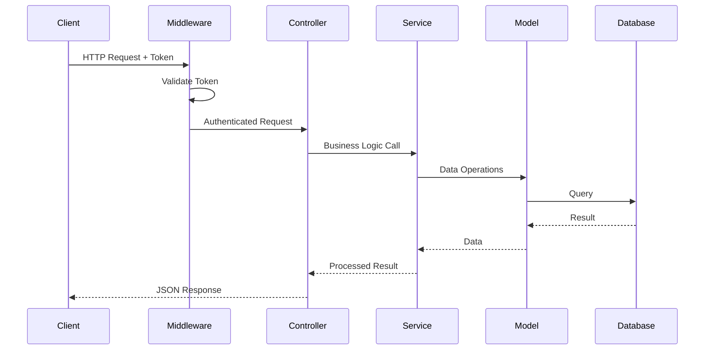
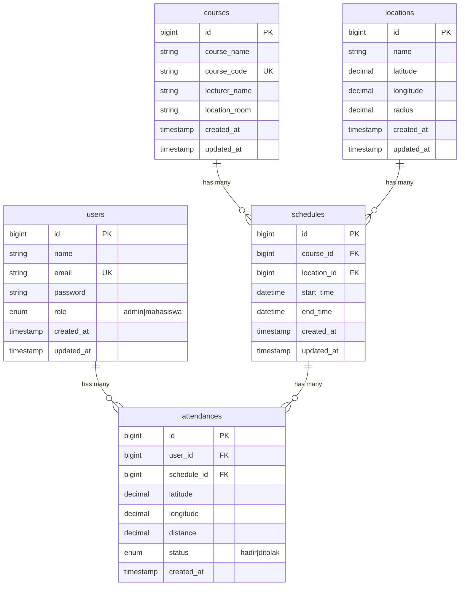

# Design Document

## Overview

API Absensi Mahasiswa Geolocation adalah RESTful API yang dibangun dengan Laravel untuk mencatat kehadiran mahasiswa berdasarkan validasi lokasi geografis. Sistem menggunakan Haversine Formula untuk menghitung jarak antara posisi mahasiswa dengan lokasi kampus yang telah ditentukan.

### Key Design Decisions

1. **Laravel Sanctum** untuk autentikasi token-based yang ringan dan aman
2. **Service Layer Pattern** untuk memisahkan business logic dari controller
3. **Haversine Formula** untuk kalkulasi jarak tanpa dependensi eksternal
4. **Form Request Validation** untuk validasi input yang terstruktur

## Architecture

```
┌─────────────────────────────────────────────────────────────┐
│                      API Layer (Routes)                      │
├─────────────────────────────────────────────────────────────┤
│                    Middleware Layer                          │
│         (auth:sanctum, throttle, role-based)                │
├─────────────────────────────────────────────────────────────┤
│                   Controller Layer                           │
│    (AuthController, AttendanceController, AdminController)   │
├─────────────────────────────────────────────────────────────┤
│                    Service Layer                             │
│  (AttendanceService, GeolocationService, ReportService)     │
├─────────────────────────────────────────────────────────────┤
│                     Model Layer                              │
│    (User, Location, Course, Schedule, Attendance)           │
├─────────────────────────────────────────────────────────────┤
│                    Database Layer                            │
│                   (MySQL/PostgreSQL)                         │
└─────────────────────────────────────────────────────────────┘
```

### Request Flow



## Components and Interfaces

### 1. Controllers

#### AuthController
```php
class AuthController extends Controller
{
    public function login(LoginRequest $request): JsonResponse
    public function logout(Request $request): JsonResponse
}
```

#### AttendanceController
```php
class AttendanceController extends Controller
{
    public function store(AttendanceRequest $request): JsonResponse
    public function history(Request $request): JsonResponse
    public function todaySchedules(Request $request): JsonResponse
}
```

#### AdminController
```php
class AdminController extends Controller
{
    // Location Management
    public function storeLocation(LocationRequest $request): JsonResponse
    public function updateLocation(LocationRequest $request, int $id): JsonResponse
    public function getLocations(): JsonResponse
    
    // Schedule Management
    public function storeSchedule(ScheduleRequest $request): JsonResponse
    public function getSchedules(): JsonResponse
    
    // Reports
    public function attendanceReport(ReportRequest $request): JsonResponse
}
```

### 2. Services

#### GeolocationService
```php
class GeolocationService
{
    private const EARTH_RADIUS = 6371000; // meters
    
    public function calculateDistance(
        float $lat1, 
        float $lon1, 
        float $lat2, 
        float $lon2
    ): float
    
    public function isWithinRadius(
        float $userLat,
        float $userLon,
        float $locationLat,
        float $locationLon,
        float $radius
    ): bool
}
```

#### AttendanceService
```php
class AttendanceService
{
    public function __construct(
        private GeolocationService $geolocationService
    )
    
    public function processAttendance(
        User $user,
        int $scheduleId,
        float $latitude,
        float $longitude
    ): array
    
    public function getUserHistory(User $user): Collection
    
    public function getTodaySchedules(): Collection
    
    private function validateScheduleTime(Schedule $schedule): bool
    private function checkDuplicateAttendance(User $user, Schedule $schedule): bool
}
```

#### ReportService
```php
class ReportService
{
    public function getAttendanceReport(
        ?string $startDate = null,
        ?string $endDate = null,
        ?int $scheduleId = null
    ): Collection
}
```

### 3. Form Requests

#### LoginRequest
```php
class LoginRequest extends FormRequest
{
    public function rules(): array
    {
        return [
            'email' => 'required|email',
            'password' => 'required|string',
        ];
    }
}
```

#### AttendanceRequest
```php
class AttendanceRequest extends FormRequest
{
    public function rules(): array
    {
        return [
            'schedule_id' => 'required|exists:schedules,id',
            'latitude' => 'required|numeric|between:-90,90',
            'longitude' => 'required|numeric|between:-180,180',
        ];
    }
}
```

#### LocationRequest
```php
class LocationRequest extends FormRequest
{
    public function rules(): array
    {
        return [
            'name' => 'required|string|max:255',
            'latitude' => 'required|numeric|between:-90,90',
            'longitude' => 'required|numeric|between:-180,180',
            'radius' => 'required|numeric|min:1',
        ];
    }
}
```

#### ScheduleRequest
```php
class ScheduleRequest extends FormRequest
{
    public function rules(): array
    {
        return [
            'course_id' => 'required|exists:courses,id',
            'location_id' => 'required|exists:locations,id',
            'start_time' => 'required|date',
            'end_time' => 'required|date|after:start_time',
        ];
    }
}
```

### 4. Middleware

#### EnsureUserIsAdmin
```php
class EnsureUserIsAdmin
{
    public function handle(Request $request, Closure $next): Response
    {
        if ($request->user()->role !== 'admin') {
            return response()->json(['message' => 'Forbidden'], 403);
        }
        return $next($request);
    }
}
```

## Data Models

### Entity Relationship Diagram



### Model Relationships

```php
// User Model
class User extends Authenticatable
{
    use HasApiTokens;
    
    protected $fillable = ['name', 'email', 'password', 'role'];
    protected $hidden = ['password'];
    
    public function attendances(): HasMany
    public function isAdmin(): bool
    public function isMahasiswa(): bool
}

// Location Model
class Location extends Model
{
    protected $fillable = ['name', 'latitude', 'longitude', 'radius'];
    
    public function schedules(): HasMany
}

// Course Model
class Course extends Model
{
    protected $fillable = ['course_name', 'course_code', 'lecturer_name', 'location'];
    
    public function schedules(): HasMany
}

// Schedule Model
class Schedule extends Model
{
    protected $fillable = ['course_id', 'location_id', 'start_time', 'end_time'];
    
    public function course(): BelongsTo
    public function location(): BelongsTo
    public function attendances(): HasMany
    
    public function isActive(): bool
}

// Attendance Model
class Attendance extends Model
{
    protected $fillable = ['user_id', 'schedule_id', 'latitude', 'longitude', 'distance', 'status'];
    
    public function user(): BelongsTo
    public function schedule(): BelongsTo
}
```

## Correctness Properties

*A property is a characteristic or behavior that should hold true across all valid executions of a system-essentially, a formal statement about what the system should do. Properties serve as the bridge between human-readable specifications and machine-verifiable correctness guarantees.*


### Property 1: Authentication Token Round-Trip

*For any* valid user credentials, logging in should return a token, and using that token for logout should invalidate it such that subsequent requests with that token return 401.

**Validates: Requirements 1.1, 1.3**

### Property 2: Protected Endpoints Require Authentication

*For any* attendance-related endpoint (POST /api/attendance, GET /api/attendance/history, GET /api/schedules/today), requests without valid authentication token should return 401 Unauthorized.

**Validates: Requirements 1.5**

### Property 3: Admin-Only Endpoints Protection

*For any* user with role "mahasiswa", requests to admin endpoints (locations, schedules management, reports) should return 403 Forbidden.

**Validates: Requirements 2.4, 3.3, 7.4**

### Property 4: Location CRUD Round-Trip

*For any* valid location data (name, latitude in [-90,90], longitude in [-180,180], positive radius), creating a location then retrieving it should return equivalent data.

**Validates: Requirements 2.1, 2.2, 2.3**

### Property 5: Schedule CRUD Round-Trip

*For any* valid schedule data with existing course_id and location_id, creating a schedule then retrieving it should return the schedule with course and location details.

**Validates: Requirements 3.1, 3.2**

### Property 6: Haversine Distance Calculation Correctness

*For any* two valid coordinate pairs (lat1, lon1) and (lat2, lon2), the Haversine formula should:
- Return 0 when coordinates are identical
- Return the same result regardless of calculation order (symmetric)
- Satisfy triangle inequality: distance(A,B) + distance(B,C) >= distance(A,C)
- Produce consistent results for the same inputs (deterministic)

**Validates: Requirements 8.1, 8.5, 4.5**

### Property 7: Distance-Based Attendance Status Determination

*For any* attendance submission where calculated distance <= location radius, status should be "hadir". *For any* attendance submission where calculated distance > location radius, status should be "ditolak".

**Validates: Requirements 4.6, 4.7**

### Property 8: Duplicate Attendance Prevention

*For any* user and schedule combination, if an attendance record already exists, subsequent attendance attempts for the same schedule should be rejected.

**Validates: Requirements 4.4**

### Property 9: Schedule Time Validation

*For any* attendance submission, if current time is outside the schedule's start_time to end_time range, the attendance should be rejected with appropriate message.

**Validates: Requirements 4.2, 4.3**

### Property 10: Attendance Data Persistence

*For any* attendance attempt (whether "hadir" or "ditolak"), the system should store user_id, schedule_id, latitude, longitude, calculated distance, and status.

**Validates: Requirements 4.8, 10.3**

### Property 11: User-Specific History Retrieval

*For any* user requesting attendance history, the returned records should only contain attendances belonging to that user (no other users' records).

**Validates: Requirements 5.1**

### Property 12: History Ordering

*For any* attendance history with multiple records, the records should be ordered by created_at in descending order (newest first).

**Validates: Requirements 5.3**

### Property 13: Report Filtering Correctness

*For any* attendance report with date range filter, all returned records should have created_at within the specified range. *For any* report with schedule_id filter, all returned records should match that schedule_id.

**Validates: Requirements 7.2, 7.3**

## Error Handling

### HTTP Status Codes

| Status Code | Condition |
|-------------|-----------|
| 200 | Successful request |
| 201 | Resource created successfully |
| 400 | Bad request / Validation error |
| 401 | Unauthorized / Invalid token |
| 403 | Forbidden / Insufficient permissions |
| 404 | Resource not found |
| 422 | Unprocessable entity / Validation failed |
| 429 | Too many requests (rate limited) |
| 500 | Internal server error |

### Error Response Format

```json
{
    "message": "Error description",
    "errors": {
        "field_name": ["Validation error message"]
    }
}
```

### Attendance-Specific Errors

| Error Condition | Response |
|-----------------|----------|
| Schedule not found | 404 with message |
| Outside schedule time | 422 with "Absensi hanya dapat dilakukan pada waktu jadwal aktif" |
| Duplicate attendance | 422 with "Anda sudah melakukan absensi untuk jadwal ini" |
| Outside radius | 200 with status "ditolak" (not an error, but recorded) |

### Exception Handling Strategy

```php
// In Handler.php or bootstrap/app.php
$app->withExceptions(function (Exceptions $exceptions) {
    $exceptions->render(function (ValidationException $e) {
        return response()->json([
            'message' => 'Validation failed',
            'errors' => $e->errors()
        ], 422);
    });
    
    $exceptions->render(function (AuthenticationException $e) {
        return response()->json([
            'message' => 'Unauthenticated'
        ], 401);
    });
    
    $exceptions->render(function (ModelNotFoundException $e) {
        return response()->json([
            'message' => 'Resource not found'
        ], 404);
    });
});
```

## Testing Strategy

### Testing Framework

- **Unit Tests**: PHPUnit (Laravel default) with Pest syntax
- **Property-Based Tests**: PHPUnit with custom generators or Pest with faker
- **Feature Tests**: Laravel HTTP testing

### Test Structure

```
tests/
├── Unit/
│   ├── Services/
│   │   ├── GeolocationServiceTest.php
│   │   ├── AttendanceServiceTest.php
│   │   └── ReportServiceTest.php
│   └── Models/
│       └── ScheduleTest.php
├── Feature/
│   ├── AuthenticationTest.php
│   ├── AttendanceTest.php
│   ├── LocationManagementTest.php
│   ├── ScheduleManagementTest.php
│   └── ReportTest.php
└── Property/
    ├── HaversinePropertyTest.php
    ├── AttendanceStatusPropertyTest.php
    └── HistoryPropertyTest.php
```

### Property-Based Testing Configuration

- Minimum 100 iterations per property test
- Use Faker for generating random valid data
- Each property test must reference design document property
- Tag format: **Feature: api-absensi-geolocation, Property {number}: {property_text}**

### Unit vs Property Test Balance

**Unit Tests** (specific examples):
- Known coordinate pairs with expected distances
- Edge cases: same coordinates, antipodal points
- Boundary conditions: exactly on radius

**Property Tests** (universal properties):
- Haversine symmetry and triangle inequality
- Status determination based on distance
- Data persistence completeness

### Test Data Generators

```php
// Coordinate Generator
function generateValidCoordinates(): array {
    return [
        'latitude' => fake()->latitude(-90, 90),
        'longitude' => fake()->longitude(-180, 180),
    ];
}

// Location Generator
function generateLocation(): array {
    return [
        'name' => fake()->company(),
        'latitude' => fake()->latitude(-7, -6), // Indonesia range
        'longitude' => fake()->longitude(106, 108),
        'radius' => fake()->numberBetween(50, 500),
    ];
}

// Schedule Generator
function generateSchedule(int $courseId, int $locationId): array {
    $start = now()->addHours(fake()->numberBetween(1, 8));
    return [
        'course_id' => $courseId,
        'location_id' => $locationId,
        'start_time' => $start,
        'end_time' => $start->copy()->addHours(2),
    ];
}
```

## API Endpoints Detail

### Authentication

#### POST /api/login
```json
// Request
{
    "email": "mahasiswa@example.com",
    "password": "password"
}

// Response 200
{
    "token": "1|abc123...",
    "user": {
        "id": 1,
        "name": "John Doe",
        "email": "mahasiswa@example.com",
        "role": "mahasiswa"
    }
}
```

#### POST /api/logout
```json
// Response 200
{
    "message": "Logged out successfully"
}
```

### Attendance

#### POST /api/attendance
```json
// Request
{
    "schedule_id": 1,
    "latitude": -6.2088,
    "longitude": 106.8456
}

// Response 200
{
    "status": "hadir",
    "distance": 45.23,
    "message": "Absensi berhasil dicatat"
}
```

#### GET /api/attendance/history
```json
// Response 200
{
    "data": [
        {
            "id": 1,
            "schedule": {
                "id": 1,
                "course_name": "Pemrograman Web",
                "start_time": "2024-01-15 08:00:00",
                "end_time": "2024-01-15 10:00:00"
            },
            "status": "hadir",
            "distance": 45.23,
            "created_at": "2024-01-15 08:15:00"
        }
    ]
}
```

### Admin Endpoints

#### POST /api/locations
```json
// Request
{
    "name": "Gedung A",
    "latitude": -6.2088,
    "longitude": 106.8456,
    "radius": 100
}

// Response 201
{
    "message": "Location created successfully",
    "data": {
        "id": 1,
        "name": "Gedung A",
        "latitude": -6.2088,
        "longitude": 106.8456,
        "radius": 100
    }
}
```

#### GET /api/reports/attendance
```json
// Request Query Params
// ?start_date=2024-01-01&end_date=2024-01-31&schedule_id=1

// Response 200
{
    "data": [
        {
            "id": 1,
            "user": {
                "id": 1,
                "name": "John Doe",
                "email": "john@example.com"
            },
            "schedule": {
                "id": 1,
                "course_name": "Pemrograman Web"
            },
            "status": "hadir",
            "distance": 45.23,
            "created_at": "2024-01-15 08:15:00"
        }
    ]
}
```
